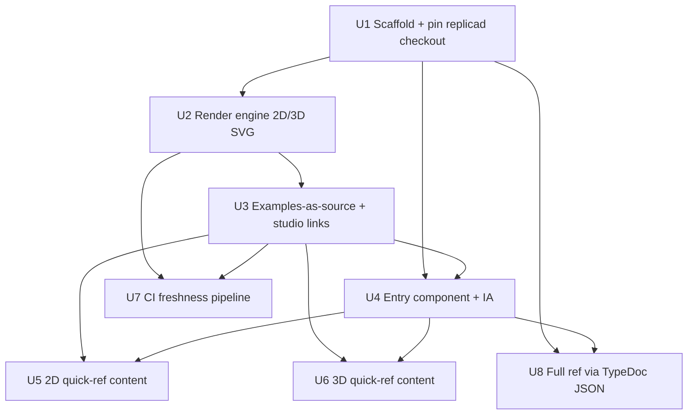

# feat: Replicad quick-reference & API guide

## Overview

Build a static documentation site ("replicad-guide") that is a better quick
reference for the CAD library replicad. It has three pages — a **2D quick
reference**, a **3D quick reference**, and a **Full API reference** — where every
entry shows how to obtain the object, an inline example of common uses, the full
call signature, and a visual. Visuals are **rendered at build time from the exact
example code shown** (2D → inline SVG, 3D → SVG projection), so they cannot drift
from the code. Interactivity is delegated to replicad's existing studio via "open
in studio" deep-links. v1 ships the two curated quick refs; v1.1 adds the full
reference with signatures generated from source.

This plan builds the pipeline and the v1 content, and specifies the v1.1 full
reference as a second phase.

## Problem Frame

replicad's tutorial is excellent, but its auto-generated TypeDoc reference is
unusable for day-to-day lookup: no entry points (e.g. `DrawingPen` is listed with
no hint you get it from `draw()`), no inline examples ("how do I draw a half
circle? rotate it?"), 2D and 3D not separated, and every argument list requires a
click-through. The guide is for someone who has done the tutorial and needs fast
recall (see origin: docs/brainstorms/2026-07-14-replicad-quick-reference-requirements.md).

## Requirements Trace

- R1. Three pages: 2D quick ref (sketching), 3D quick ref (making + manipulating), Full API reference.
- R2. 2D→3D bridge folded into the top of the 3D page; cross-linked from the 2D page.
- R3. Quick refs ordered most-common → least-common; obscure ops hidden/deemphasized with a pointer to the full ref.
- R4. Every entry states its **entry point** — no entry references an object without showing how to obtain one.
- R5. Every entry shows inline example(s) of common uses.
- R6. Every entry shows the full call signature inline (args, types, defaults), extracted from source — not hand-authored.
- R7. 2D examples render to inline SVG (build time, via `Drawing.toSVG` family).
- R8. 3D examples render as a static SVG projection + an "open in studio" deep-link. No WASM shipped to readers.
- R9. No drift: every visual is produced from the exact example code shown (the code record is the single source of truth).
- R10. Quick refs teach only the modern `draw()`/`Drawing` API; legacy `Sketcher` gets signature+doc in the full ref only.
- R11. Consistent terminology + a glossary (DrawingPen, Drawing, Blueprint, Sketch, Shape, Plane, Finder).
- R12. Link out to the tutorial and `use-as-a-library` rather than re-teaching setup.
- R13. Full ref: every public export gets a full signature + description on scannable grouped-by-concept pages; no click-through for args.
- R14. Full ref: geometry entries get example+visual; trivial utilities get signature+doc; legacy `Sketcher` gets signature+doc, no visual.
- R15. Pin a replicad **git ref** + show it (badge); CI regenerates signatures and re-runs every example, failing on breakage.

## Scope Boundaries

- Not a tutorial replacement; complements and links to it.
- No in-browser WASM, no live/editable in-page viewer, no editable snippets in v1 — interactivity is delegated to studio via links.
- Does not re-document integration/hosting/WASM-setup; links to `use-as-a-library`.
- Does not document internal/private APIs (respect TypeDoc `@ignore` / non-exported).
- v1 = the two curated quick-reference pages + pipeline + CI. v1.1 = the full reference, site-wide search, and the scale hardening (incremental cache, process recycling, shuffled-order check).
- **Examples are first-party, in-repo, and trusted.** The evaluator runs them at build time with full host + OpenCascade-FS access — it is **not a sandbox** (build-time code execution by design). Any externally-contributed or auto-generated example must be human-reviewed before entering the corpus.

## Context & Research

### Relevant Code and Patterns (in the pinned `../replicad` sibling monorepo checkout — see Consumption model)

- **Headless eval + WASM boot:** `packages/replicad-cli/src/cli.ts` (`createCliEvaluator`) — loads `replicad-opencascadejs/src/replicad_single.js` factory with `locateFile` → `replicad_single.wasm`, sets manifold, `createEvaluator({replicad, oc, manifold})`. Node ≥20.6. CLI-internal (not an exported API) — we port/vendor it.
- **Code evaluation engine:** `packages/replicad-evaluator` — `createEvaluator(...)`, `buildShapesFromCode(code, params)`, `extractDefaultParamsFromCode(code)`, `getShapeEntries()`. Ships raw `.ts` via `exports`. Auto-detects "module" vs "function" example formats. Calls `replicad.setOC(oc)` internally.
- **Render output discriminator:** `replicad-evaluator/src/render.ts` — 2D entries have `{ format: "svg", paths, viewbox }`; 3D entries carry a mesh/`shape`. `saveOutput.ts` uses `format !== "svg"` to pick a projectable 3D shape.
- **3D → SVG projection:** `packages/replicad-cli/src/projectSvg.ts` (`prettyProjectionSvg`, CLI-internal) — `ProjectionCamera` from bbox corner + `drawProjection(shape, camera)` → `{visible, hidden}` Drawings → `toSVGPaths()`/`toSVGViewBox()`. `drawProjection`/`ProjectionCamera` at `packages/replicad/src/draw.ts` + `.../projection/ProjectionCamera.ts`. Example: `packages/replicad-docs/docs/examples/projections.mdx`.
- **2D SVG methods:** `Drawing.toSVG/toSVGViewBox/toSVGPaths` (`packages/replicad/src/draw.ts:208`).
- **Open-in-studio deep-link:** `packages/replicad-docs/src/theme/CodeBlock/WorkbenchButton/index.js` — JSZip DEFLATE-6 → base64 → `encodeURIComponent`; the button uses the **query** form (`url.searchParams.set("code", …)`). Studio `/workbench` `codeInit` reads **both** hash and query (`getHashParam("code") || getUrlParam("code")`) and strips whichever it read. Round-trip decode in `packages/studio/src/utils/loadCode.js`. Needs `jszip@^3.10.1`.
- **Signature source:** `docusaurus-plugin-typedoc` config in `packages/replicad-docs/docusaurus.config.js` (entry `../replicad/src/index.ts`, tsconfig `../replicad/tsconfig.json`) — a **workspace-relative** sibling path, which is why our checkout-based consumption model is required. Source is JSDoc-annotated (`@param/@returns/@category`). Emit JSON with `typedoc --json`.
- **Seed inventory:** `docs/reference/replicad-api-inventory.md` (this repo) — curated 2D/3D/docs inventory + commonness tags; the content seed. Re-verify completeness against the TypeDoc JSON export.

### Institutional Learnings

- None — greenfield repo (`docs/solutions/` does not exist). This project is a good candidate to start capturing learnings (WASM-in-Node init, build-time example isolation, TypeDoc JSON schema stability, drift-gate CI).

### External References

- Skipped — replicad's own packages provide direct, verified patterns for every hard part. Studio domain is hardcoded `https://studio.replicad.xyz`.

## Key Technical Decisions

- **Consumption model: a pinned git checkout of the sibling `../replicad` monorepo, not npm packages.** The npm `replicad` tarball ships only `dist/` (no `src`, no `tsconfig`), and the pieces we need — `prettyProjectionSvg` / `createCliEvaluator` (CLI-internal, not exported) and `src/index.ts` for TypeDoc — exist only in the monorepo source. So the guide pins the monorepo by **git ref/tag** (git submodule or pnpm workspace link), builds the packages it needs, and both consumes them at runtime and reads their source. R15 "pin a version" = pin this git ref. (Alternative if ever published standalone: npm deps + vendored CLI helpers + TypeDoc against `dist/replicad.d.ts` — heavier and lossy; deferred.)
- **Versions are independent, not lockstep:** the `replicad` package is `0.23.1` (latest on npm and in the checkout); `replicad-cli`/`replicad-evaluator` are `0.23.3`. Do **not** pin `replicad@0.23.3` — it does not exist. The git-ref pin sidesteps npm-version skew.
- **Static site with Astro.** Build-time rendering, content collections, MDX, inline SVG, and near-zero client JS fit this guide's "rich HTML + SVG, static pages" shape. Chosen over Docusaurus (heavier, React-coupled, less friendly to bespoke per-entry layouts — though it is what replicad uses) and plain Vite (more glue). Swappable; the render engine and data model are framework-agnostic. **Two-step build:** a standalone `node --expose-gc` render step (via `tsx`) emits SVG/data first; `astro build` then consumes them as static assets and never boots the evaluator or imports its raw-TS.
- **Reuse `replicad-evaluator`; do not reimplement eval or WASM loading.** Port `createCliEvaluator`'s boot sequence and call `buildShapesFromCode`. Grounded in `replicad-cli`.
- **2D vs 3D by render-output `format`.** Per entry in the result array: `format === "svg"` → emit `paths`+`viewbox` directly; else → `drawProjection` projection SVG (port `prettyProjectionSvg`).
- **Examples authored once as data (R9).** Each example is a record `{ id, code: string, title, group, commonness }`. The same `code` record is (a) displayed (as a lossless-rendered projection) and (b) executed by the render engine. No second copy exists, so the visual cannot drift from the shown code.
- **Signatures generated via `typedoc --json`** against the checkout's `src/index.ts` — never hand-authored (R6/R13).
- **Open-in-studio** via the JSZip/DEFLATE-6/base64 encoding, code passed to `studio.replicad.xyz/workbench` (R8; form confirmed against live studio).

## Open Questions

### Resolved During Planning

- Consumption model → pinned git checkout of the `../replicad` monorepo (runtime pkgs + CLI-internal source + `src` for TypeDoc); pin by git ref.
- replicad version → `replicad` is `0.23.1`; `replicad-cli`/`replicad-evaluator` are `0.23.3`; pin the git ref rather than an npm version tuple.
- Static-site tooling → Astro (rationale above; deferred item in origin).
- Build-time vs runtime rendering → build-time for everything; no reader WASM (origin decision confirmed feasible via replicad-cli).
- 2D vs 3D visual path → `format` discriminator + `prettyProjectionSvg` for 3D.
- Signature production → TypeDoc JSON extraction from the checkout source.
- Single-source-of-truth mechanism (R9) → one `code` record per example, executed and displayed (display is a lossless projection).

### Deferred to Implementation

- Exact per-export `ESSENTIAL/COMMON/OBSCURE` tagging (author judgment during content authoring; seed from the inventory).
- Whether the TypeDoc JSON is committed as an artifact or generated on each build (decide when wiring U8).
- Confirm the live studio code-param form (`?code=` vs `#code=`) with a round-trip test before committing (monorepo checkout and deployed studio may differ; both are read by `/workbench`).
- If ever consuming published packages instead of the checkout: verify `@category`/`@param` JSDoc survive into `dist/replicad.d.ts` (else U8 grouping/descriptions degrade), and that WASM subpaths (`replicad-opencascadejs/src/replicad_single.wasm`, `manifold-3d/manifold.wasm`) resolve (subpath `exports` gating can throw `ERR_PACKAGE_PATH_NOT_EXPORTED`).
- Fonts for `drawText` examples in Node (evaluator `fontPath`); provide a bundled font if any 2D example uses text.
- Reconciling the full export list with the seed inventory (regenerate from TypeDoc JSON at U8; the inventory is a starting point, not exhaustive).
- Multi-shape 3D examples: project the first 3D shape, or compose all into one view? (decide when building U2).
- Whether FS-touching examples run in an isolated worker vs. a lint ban on OC virtual-FS writes.
- Search engine choice (Pagefind vs Fuse) for the v1.1 site-wide search; worker-pool sharding for build time — a deferred lever, triggered only if the measured full-render time exceeds the U2 budget.

## High-Level Technical Design

> *This illustrates the intended approach and is directional guidance for review, not implementation specification. The implementing agent should treat it as context, not code to reproduce.*

```
Author writes each example ONCE:  src/examples/<id>.ts
   record: { id, code: "<the example source string>", title, group, commonness }
        │
        ▼   build time (Node ≥20.6, standalone `node --expose-gc` step, before astro build)
render engine (U2)  — boot once, reuse across all examples
   setOC(replicad_single.wasm) + manifold        [ported from replicad-cli]
   result = buildShapesFromCode(code, defaultParams)
        │   FAILURE = returned {error} object | empty array | any entry.error | empty paths
        │   (buildShapesFromCode returns {error} — it does NOT throw). Assert, else fail build.
        ▼   iterate the (heterogeneous) result entries → renderExample returns an ARRAY:
        ├─ entry.format === "svg"    ──▶ 2D:  <svg viewBox={viewbox}>{paths}</svg>
        └─ first 3D (bbox) entry     ──▶ 3D:  prettyProjectionSvg(shape)   [ported; CLI-only]
                                            (ProjectionCamera from bbox + drawProjection)
        │
        ▼
per-entry data = { entryPoint, signature (typedoc json, U8), code, svgs[], studioUrl }   // 1+ visuals
        │  the SAME `code` record feeds all outputs (R9):
   ┌───────────────┬──────────────────────┬───────────────────────────┐
   ▼               ▼                      ▼
 displayed code   rendered SVG(s)        open-in-studio link
 (lossless proj.) (inline, static)       jszip→base64→studio /workbench  (U3)
```

## Implementation Units

Dependency graph (Phase 1 = U1–U7 → v1; Phase 2 = U8 → v1.1):



---

- [x] **Unit 1: Scaffold site + pin replicad checkout**

**Goal:** A buildable Astro site wired to a pinned `../replicad` checkout, with repo structure.

**Requirements:** R1, R12, R15 (ref pin)

**Dependencies:** None

**Files:**
- Create: `package.json`, `astro.config.mjs`, `tsconfig.json`, `.nvmrc` (Node 20.12.1), `vitest.config.ts`
- Create: `src/pages/index.astro` (landing: object-flow mental model → three pages, + tutorial/use-as-a-library links)
- Create: `src/lib/replicad-version.ts` (single source for the pinned git ref/tag + human-readable version; drives the badge)
- Modify: `README.md`

**Approach:**
- Add the `../replicad` monorepo as a **pinned git submodule** (or pnpm workspace link) at a specific ref, and build the packages it provides (`replicad` 0.23.1, `replicad-evaluator`/`replicad-cli` 0.23.3, `replicad-opencascadejs`, `manifold-3d`). The checkout is a pre-build tree, so run its build (or consume TS via `tsx`) before rendering. Add `jszip@^3.10.1`, `tsx`; dev: `astro`, `vitest`. Do **not** `pnpm add replicad@0.23.3` (nonexistent).
- Establish `src/lib`, `src/examples`, `src/components`, `src/layouts`, `src/pages`, `scripts`.
- Landing page leads with the object-flow mental model (2D → bridge → 3D → full ref) as the way to choose a page, each with a one-line "when to use," then secondary outbound tutorial/use-as-a-library links (R12).

**Patterns to follow:** Node/pnpm conventions from `../replicad` (`.nvmrc` v20.12.1, `"type": "module"`); the requirements doc's object-flow diagram.

**Test scenarios:**
- Test expectation: none — scaffolding/config. Verified by a clean two-step build.

**Verification:** the two-step build succeeds — the `node --expose-gc` render step (via `tsx`) runs first and emits SVG/data, then `astro build` consumes them (Astro never boots the evaluator); landing page shows the mental model + three pages + outbound links.

---

- [x] **Unit 2: Build-time render engine (2D SVG + 3D projection)**

**Goal:** A Node module that boots the evaluator once and turns an example's code into an array of SVG visuals (2D inline and/or 3D projection), with loud failure handling.

**Requirements:** R7, R8 (visual half), R9

**Dependencies:** U1

**Files:**
- Create: `src/lib/evaluator-setup.ts` (WASM/OC + manifold boot, ported from `createCliEvaluator`)
- Create: `src/lib/render-engine.ts` (`renderExample(code) → Array<{ kind: "2d"|"3d", svg }>` — one example can yield multiple visuals)
- Create: `src/lib/project-svg.ts` (port of `prettyProjectionSvg`)
- Test: `src/lib/render-engine.test.ts`

**Approach:**
- Boot the OC WASM + manifold **once** and reuse the evaluator for the whole build. Safe *only because OC is never swapped* — record "single OC/manifold instance; never re-`setOC` mid-build" as an explicit U2 invariant (replicad holds OC refs in module-level singletons incl. an enum cache). Assert `FinalizationRegistry` exists at boot (else replicad leaks every OCCT object). Source the boot from the checkout's `replicad-cli`, and verify `require.resolve('replicad-opencascadejs/src/replicad_single.wasm')` and `require.resolve('manifold-3d/manifold.wasm')` resolve under the checkout model before relying on the copied boot.
- **Failure is signalled by the return value, not exceptions.** `buildShapesFromCode` catches internally and returns `{ error: true, message, stack }` — it does **not** throw (mirror the CLI's `if (!Array.isArray(result)) throw`). Treat as failure, per example id: a returned error object, an **empty array**, any entry with `entry.error === true` (per-shape mesh failures are swallowed onto the entry but stay in the array), or empty `paths`.
- The result is a **heterogeneous array**: some entries are 2D `{ format: "svg", paths, viewbox }`, others 3D meshes — one example can mix both (e.g. a solid + several `drawProjection` drawings), so `renderExample` returns an **array** of visuals. Iterate per entry: `format === "svg"` → inline `<svg viewBox>{paths}`; the **first bbox-bearing 3D entry** → the projection port. Read that shape **from the current result array, never from the shared `getShapeEntries()`/`shapesMemory` singleton** (it holds the previous example's shape and would leak across examples).
- Port `prettyProjectionSvg` (CLI-internal, not exported; 3D-only, requires `boundingBox`): `ProjectionCamera` from the bbox corner + `drawProjection` → visible + hidden Drawings → `toSVGPaths`/`toSVGViewBox`.
- **Build wiring:** `renderExample` runs only inside the standalone `node --expose-gc` render step (U3's `generate-visuals`), not inside Astro/Vite — the raw-TS `replicad-evaluator` import must never enter the Astro build graph.
- **Memory hygiene:** OCCT objects are freed only via a non-deterministic `FinalizationRegistry` and the evaluator pins the last shape, so the WASM heap grows monotonically — a real OOM risk at **v1.1 scale (250+)**, not v1 (dozens). For v1, run the render step under `node --expose-gc` with a periodic `global.gc()` (cheap insurance). The heavier **process-recycling backstop** (dispose/re-boot every N) and the **≥300-example RSS test** are **deferred to U8/v1.1, gated on a measured v1 render baseline** (same measurement-gated pattern as worker-pool sharding). (The WASM heap is separate from Node's `--max-old-space-size`.) Keep `renderExample`/`generate-visuals` batch-dispatchable so recycling/sharding can be added without a rewrite.

**Execution note:** Start with a failing test for the 2D and 3D contract (in → array of SVGs) and for the return-value failure model, then implement.

**Patterns to follow:** `replicad-cli/src/cli.ts` (`createCliEvaluator`, the `!Array.isArray` check), `replicad-cli/src/projectSvg.ts` (`prettyProjectionSvg`), `replicad-cli/src/saveOutput.ts` (entry selection), `replicad-evaluator/src/{builder,render}.ts` (failure/empty/mixed-output behavior).

**Test scenarios:**
- Happy path: a `drawCircle(20)` example → a 2D SVG with a `viewBox` and ≥1 `<path>`.
- Happy path: an `extrude`-based example → a 3D projection SVG with visible + hidden path groups.
- Happy path (mixed): an example returning a 3D solid **and** 2D drawings (like `projections.js`) → an array with the 3D projection and the 2D SVGs; nothing dropped.
- Error path: an example that fails (e.g. invalid fillet) → `buildShapesFromCode` returns an error object → render engine throws `[id] message`; no blank SVG emitted.
- Edge case: an example returning nothing / a non-shape → empty array → failure naming the id (not silent success).
- Edge case: a multi-shape example with one broken shape (`entry.error === true`) → failure, not partial success.
- Determinism (supports R9): rendering the same code twice yields identical SVG output.

**Verification:** Known 2D, 3D, and mixed examples produce non-empty, well-formed SVG; a deliberately broken example and an empty-output example both fail the render with the example id. (The ≥300-example memory test lands in U8/v1.1.)

---

- [x] **Unit 3: Examples-as-source-of-truth + open-in-studio links**

**Goal:** The example data model (code authored once), the render step that feeds U2 and emits per-entry visual/data assets, and the studio deep-link generator.

**Requirements:** R5, R8 (link half), R9

**Dependencies:** U2

**Files:**
- Create: `src/examples/index.ts` (example record type + registry), `src/examples/*.ts` (records)
- Create: `src/lib/studio-link.ts` (`toStudioUrl(code) → string`)
- Create: `scripts/generate-visuals.ts` (standalone `node --expose-gc` step: iterate examples → U2 → write SVG(s) + entry data)
- Test: `src/lib/studio-link.test.ts`, `src/examples/examples.test.ts`

**Approach:**
- One record per example: `{ id, code: string, title, group, commonness }`. The `code` string is the *only* copy — displayed, executed by U2, and encoded into the studio link.
- **Example contract (lint every example):** uses the ambient `replicad` global (no `import`), defines `main` (+ optional `defaultParams`/`defaultName`), no top-level `export` unless intentionally module-mode (the evaluator classifies module-vs-function via `/^\s*export\s+/m` and extracts `main`/`defaultParams` by name — renaming or misclassifying silently changes the execution path). Forbid/namespace OpenCascade virtual-FS writes (serialization writes a fixed `some_file.brep` into the shared `oc.FS`, which cross-contaminates), or run FS-touching examples in their own worker.
- **R9 scope:** "no drift" holds *within the replicad ambient*. If the site ever adds a "copy to run standalone" affordance, it must prepend the `import` — that transform is the one sanctioned place displayed code differs from the ambient source.
- **R9 display integrity:** the displayed block is a *lossless rendered projection* of the one `code` record — emit it via a raw/`<pre>` path that round-trips to the exact source (syntax highlighting / MDX escaping must not mutate the code body). Executed and displayed strings both trace to the same record.
- `toStudioUrl`: reuse ONLY the encoding — JSZip file `code.js`, DEFLATE **level 6** → base64 → `encodeURIComponent`. On the form: the canonical `WorkbenchButton` generator uses the **query** form (`?code=`); studio's `/workbench` `codeInit` reads **both** (`getHashParam('code') || getUrlParam('code')`) and strips whichever it read. Match the canonical generator (`?code=`) unless a round-trip test against the **live** studio shows otherwise (monorepo checkout and deployed studio may differ — confirm before committing). Lower-drift alternative for hosted files: `studio.replicad.xyz/share/<encodeURIComponent(rawFileURL)>`.
- **v1: no cache — render all examples** (dozens; fast, and trivially satisfies R9/R15). The **incremental cache** (manifest `id → { keyHash, svgPath }`, key = `hash(code + pinned-ref + render-options + fontId)` so a ref bump invalidates everything) is **deferred to U8/v1.1**, where the 250+ corpus makes skipping unchanged work worthwhile. Keep `generate-visuals` structured so the cache can be added without a rewrite.

**Patterns to follow:** `replicad-docs/src/theme/CodeBlock/WorkbenchButton/index.js` + `studio/src/utils/{dumpCode,loadCode}.js` (encoding); `replicad-evaluator/src/builder.ts` (contract symbols).

**Test scenarios:**
- Integration (R9): the string displayed by the page and the string executed by U2 are the same record field — assert identical for a sample entry (no divergence path exists).
- Display integrity (R9): text extracted from the rendered code block equals `example.code` character-for-character (highlighting/escaping is lossless).
- Happy path: `toStudioUrl(code)` round-trips — decoding it with studio's `loadCode` algorithm (base64 → JSZip → `code.js`) yields the original `code`; verified against the live studio for the chosen form.
- Edge case: code with unicode/special characters round-trips unchanged.
- Lint: an example that renames `main`, adds a stray top-level `export`, or writes to the OC-FS is rejected.
- Happy path: `generate-visuals` writes the SVG(s) per example and fails the run (naming the id) if any example fails U2's checks.

**Verification:** Every registered example passes the contract lint, has generated SVG(s) + a working studio link (decodes back to source), and the displayed code round-trips to the record.

---

- [x] **Unit 4: Per-entry component, page layout, and findability**

**Goal:** The reusable entry "card" and page shell (nav, TOC/anchors, sticky section nav, version badge, glossary, cross-links, responsive).

**Requirements:** R1, R2 (cross-link), R3, R4, R5, R11, R15 (badge)

**Dependencies:** U1 (consumes U3 data)

**Files:**
- Create: `src/components/ApiEntry.astro` (entry point · signature · example(s) · visual(s)+alt · copy-to-clipboard · open-in-studio)
- Create: `src/layouts/ReferenceLayout.astro` (global nav across the 3 pages, in-page TOC/anchors, sticky section nav, responsive)
- Create: `src/components/VersionBadge.astro` (reads `src/lib/replicad-version.ts`), `src/components/Glossary.astro`
- Test: `src/components/api-entry.test.ts`
- (Site-wide search index → deferred to U8/v1.1; v1 findability is grouped TOC + anchors + Ctrl-F.)

**Approach:**
- **Per-entry card template (pin it):** header row = name + entry-point + commonness tag; signature block (wide signatures wrap/scroll within the block, no page overflow); then a code+visual pair (two-column on wide, stacked on narrow). **Multi-example** entries (R5) repeat the code+visual pair. **No-visual** entries (legacy `Sketcher`, trivial utilities in U8) omit the visual slot cleanly (not blank). The **entry-point** field is required (enforces R4).
- **Visual accessibility:** every inline SVG is emitted `role="img"` with a `<title>` derived from the entry name + example (e.g. "drawCircle(20) — a circle"); a content lint fails any visual without a non-empty accessible name.
- **Copy-to-clipboard** on each code block (with a copied-confirmation state) — the one small client-JS island on otherwise-static pages; the copied text is exactly `example.code` (consistent with R9).
- **Obscure entries (R3):** rendered **deemphasized but always visible** (lighter/condensed row + pointer to the full ref) — *not* collapsed, so anchors and Ctrl-F reach them.
- **v1 findability:** grouped TOC + in-page anchors + sticky section nav, relying on browser Ctrl-F over always-visible content. Site-wide search ships with the 250+ corpus in U8/v1.1.
- **Cross-links (R2):** the 2D page links to the 3D bridge (exists in v1). Since the **full reference does not exist until v1.1**, "see full ref" pointers in v1 either link to upstream TypeDoc (interim) or are suppressed until U8; U8 flips them to internal per-symbol anchors. Decide the interim target when building U4.
- **Responsive:** one primary breakpoint; below it the code+visual pair stacks, wide code/signatures scroll horizontally within their block, and the sticky section nav collapses into a top menu.
- Version badge shows the pinned replicad ref on every page.

**Patterns to follow:** Astro components/content collections; anchors/TOC conventions.

**Test scenarios:**
- Happy path: an `ApiEntry` with full data renders all parts (entry point, signature, example, visual, copy button, open-in-studio).
- Edge case: a **multi-example** entry renders a code+visual pair per example; a **no-visual** entry (Sketcher/trivial) omits the visual slot cleanly.
- Edge case (R4): an `ApiEntry` missing the entry-point field fails a content lint.
- Accessibility: every rendered visual has a non-empty accessible name (`role="img"` + `<title>`); the lint fails otherwise.
- Happy path (R3): an `OBSCURE` entry renders deemphasized **and remains in the DOM** (anchor/Ctrl-F reachable) with a pointer to the full ref.
- Happy path (R15): the version badge displays the pinned ref.

**Verification:** A sample page of entries renders with consistent cards (incl. multi-example and no-visual variants), accessible visuals, copy buttons, and deemphasized-but-visible obscure entries; the entry-point rule is enforced; TOC/anchors navigate the page.

---

- [x] **Unit 5: 2D quick-reference content**

**Goal:** The curated 2D page — `draw()` pen, canned `drawX` shapes, `Drawing` ops — ordered common → obscure, each entry with entry point + example(s), answering the motivating questions (half circle, rotate a drawing).

**Requirements:** R1, R3, R4, R5, R10

**Dependencies:** U3, U4

**Files:**
- Create: `src/pages/2d.astro`
- Create: `src/examples/2d/*.ts` (one record per entry)
- Test: `src/examples/2d/coverage.test.ts`

**Approach:**
- Order by commonness from the seed inventory (`docs/reference/replicad-api-inventory.md` §1). Modern `draw()`/`Drawing` API only (R10). End with a cross-link to the 3D bridge (R2). Include explicit "half circle" and "rotate a drawing" examples.

**Patterns to follow:** `ApiEntry`/layout (U4); seed inventory §1.

**Test scenarios:**
- Happy path: every 2D example record compiles and renders SVG at build (via U2) — the page has no broken entries.
- Happy path (R5): the page includes a half-circle example and a `Drawing.rotate` example.
- Edge case (R10): no legacy `Sketcher` API appears on the page (content lint).

**Verification:** 2D page builds with all visuals present, ordered common→obscure, modern API only.

---

- [x] **Unit 6: 3D quick-reference content**

**Goal:** The curated 3D page — bridge band (sketchOnPlane/planes) then make (extrude/revolve/loft) and manipulate (booleans, fillet/chamfer/shell, transforms, finders, export).

**Requirements:** R1, R2, R3, R4, R5, R8

**Dependencies:** U3, U4

**Files:**
- Create: `src/pages/3d.astro`
- Create: `src/examples/3d/*.ts`
- Test: `src/examples/3d/coverage.test.ts`

**Approach:**
- Open with the 2D→3D bridge band (R2), then make/manipulate, ordered by commonness (seed inventory §2–§6). Each 3D entry gets a static projection SVG + open-in-studio link (R8).

**Patterns to follow:** `ApiEntry`/layout (U4); seed inventory §2–§6; `projectSvg.ts` output via U2.

**Test scenarios:**
- Happy path: every 3D example compiles and renders a projection SVG at build.
- Happy path (R8): each 3D entry has a working open-in-studio link.
- Happy path (R2): the page opens with the bridge band and the 2D page links to it.

**Verification:** 3D page builds with projection visuals + studio links; bridge is the opening section.

---

- [x] **Unit 7: CI freshness pipeline**

**Goal:** CI that re-runs every example against the pinned replicad ref and fails loudly on breakage; version badge stays truthful.

**Requirements:** R9, R15

**Dependencies:** U2, U3

**Files:**
- Create: `.github/workflows/build.yml`
- Create: `scripts/check-examples.ts` (run all examples through U2; non-zero exit on any failure)

**Approach:**
- **v1: render ALL examples on every PR** (dozens; fast, and directly satisfies R9/R15 — every example re-runs, breakage fails CI). The **incremental (cache-keyed) render** and the ref-bump/`workflow_dispatch` full-gate split are **deferred to U8/v1.1**, when the 250+ corpus makes full re-render costly.
- Failure detection uses U2's return-value checks (array present, non-empty, no `entry.error`), not exceptions. Capture per-example stdout/stderr and, on failure, surface it attributed to the example id; treat any render-path `console.error` / `entry.error` as build-failing (otherwise swallowed).
- Run the standalone render step with `node --expose-gc` (so U2's `global.gc()` isn't a silent no-op), then `astro build`. Set a job `timeout-minutes` and note the runner memory budget (GitHub Linux ≈ 7GB; WASM heap is separate from `--max-old-space-size`). The **process-recycling backstop and shuffled-order leakage check are deferred to U8/v1.1** (scale-driven); v1 relies on U2's structural leakage fixes.
- **Pin the replicad git ref** (submodule/workspace) — the ref-bump is the only place it moves. If any peers are ever consumed as npm packages, pin them **exactly** (upstream uses ranges, e.g. `manifold-3d: ^3.0.1`) so a transitive bump can't break examples outside the gate.

**Patterns to follow:** standard GitHub Actions Node/pnpm workflow (with submodule checkout); Node 20.12.1 from `.nvmrc`; `replicad-cli/src/cli.ts` `!Array.isArray` failure check.

**Test scenarios:**
- Integration (R15): bumping the pinned replicad ref re-runs all examples; a breaking change makes `check-examples` exit non-zero (CI red) naming the example.
- Happy path: with all examples valid, `check-examples` exits zero and the build passes.
- Edge case: a render-path `console.error` / `entry.error` fails the build with the offending example id.
- (Incremental-render and shuffled-order tests move to U8/v1.1.)

**Verification:** clean tree → green; one broken example → red with a named failure; a replicad-ref bump re-runs all examples.

---

- [ ] **Unit 8: Full API reference via TypeDoc JSON (v1.1)**

**Goal:** Generate the full reference from source: every public export with signature + description on scannable, concept-grouped pages; geometry entries get example+visual; trivial utilities and legacy `Sketcher` get signature+doc. Also lands the v1.1 scale hardening.

**Requirements:** R6, R13, R14, R10 (legacy home)

**Dependencies:** U1, U4 (reuses U2/U3 for geometry visuals)

**Files:**
- Create: `scripts/generate-api.ts` (`typedoc --json` → normalized entry data grouped by `@category`)
- Create: `src/pages/reference/[...group].astro` (or per-group pages)
- Create: `src/lib/api-model.ts` (types for extracted entries), `src/lib/search-index.ts` (site-wide search)
- Test: `scripts/generate-api.test.ts`, `src/lib/search-index.test.ts`

**Approach:**
- Run `typedoc --json` against the **checkout's** `src/index.ts` + `tsconfig.json` (available because we consume the monorepo source; an npm dep would ship only `dist`). If ever on published packages, run TypeDoc on `dist/replicad.d.ts` and **verify `@category`/`@param` survive the `.d.ts` emit** (else grouping/descriptions degrade). Transform to `{ name, signature, params, defaults, description, category, kind }`, group by `@category` (not alphabetical). Reconcile the full export set against the seed inventory and flag gaps. Geometry entries get example+visual (U2/U3); trivial utilities and legacy `Sketcher` render signature+doc only.
- **v1.1 scale hardening lands here** (all gated on a measured v1 render baseline): site-wide **search index**; **incremental cache** (manifest + ref-keyed hashing); **process-recycling backstop** + **≥300-example RSS test**; **shuffled-order leakage check**; optional **worker-pool sharding**.

**Patterns to follow:** `replicad-docs` TypeDoc config; seed inventory for grouping/commonness; `ApiEntry` (U4).

**Test scenarios:**
- Happy path (R13): every exported symbol in the TypeDoc JSON appears in the generated model with a signature and (where present) description.
- Happy path (R13): entries are grouped by `@category`, not alphabetically; args are visible without click-through.
- Happy path (R14): a geometry entry (e.g. `extrude`) carries an example+visual; a trivial utility (e.g. `isSame`) and a legacy `Sketcher` entry render signature+doc only.
- Edge case: an export with no JSDoc description still renders (signature-only) rather than being dropped.
- Scaling: rendering the full corpus (≥300) under `--expose-gc` with process recycling stays within the runner memory budget.
- Happy path: site-wide search returns the right page+anchor for a symbol name/alias.
- Integration (leakage): shuffled-order rendering yields identical output to sorted order.

**Verification:** Full-reference pages list all exports grouped by concept with inline signatures; geometry entries show visuals; search works; regeneration reflects source changes.

## System-Wide Impact

- **Interaction graph:** greenfield app; internal blast radius is low. The build pipeline (U2/U3) is the shared seam consumed by U5/U6/U8 and gated by U7.
- **External contract surfaces (the real risk):**
  - **replicad source availability** — the guide reads monorepo source (CLI-internal helpers + `src` for TypeDoc) via a pinned git checkout; switching to npm packages would remove those source paths (only `dist` ships). This consumption model is a load-bearing decision, pinned by git ref.
  - **replicad ref** — examples and signatures are generated against the pinned ref; a bump can break examples (mitigated by U7 CI).
  - **studio URL contract** — the `studio.replicad.xyz/workbench` code param (JSZip/DEFLATE-6/base64; `?code=` or `#code=`) is an external contract; confirm against the live studio, and if it changes, open-in-studio links degrade to a dead link (not a broken page).
  - **TypeDoc JSON schema** — can change across TypeDoc versions (mitigated by pinning TypeDoc).
- **Error propagation:** the evaluator signals failure by **return value** (`{error}` object / empty array / per-entry `entry.error`), *not* exceptions — the build must inspect returns and fail loudly with the example id (U2 → U7), never emit a blank visual. Example `console.error`/`console.log` is captured and attributed per id.
- **State/build risks:** one OC/manifold instance for the whole build (reuse is safe *only* because OC is never swapped); the WASM heap grows monotonically (force GC in v1; process-recycle in v1.1); example code is **not sandboxed** and trusted (shared `globalThis` + OC virtual-FS + pinned `shapesMemory`), so read the current result array rather than singletons; a shuffled-order equality check (v1.1) guards leakage at scale.
- **Unchanged invariants:** replicad itself is not modified; this repo only consumes it. No upstream PR in scope.

## Risks & Dependencies

| Risk | Likelihood | Impact | Mitigation |
|------|-----------|--------|------------|
| Consumption model conflated (npm dep ships only `dist`; CLI helpers not exported; TypeDoc needs `src`) | — (corrected) | High | Declare ONE model: pinned **git checkout** of `../replicad` providing runtime pkgs + source; npm+vendored+`.d.ts` deferred |
| Pinned `replicad@0.23.3` does not exist on npm (packages versioned independently) | — (corrected) | High | Pin the **git ref**, not an npm version; `replicad` is `0.23.1`, cli/evaluator `0.23.3` |
| WASM subpath (`replicad_single.wasm`/`manifold.wasm`) may be `exports`-gated → `ERR_PACKAGE_PATH_NOT_EXPORTED` at boot | Low | High | Verify `require.resolve` of both under the checkout model before relying on the copied boot |
| Evaluator signals failure by **return value** (`{error}` / empty array / `entry.error`), not exceptions → broken examples silently "pass" | High if unhandled | High | U2 asserts array present + non-empty + no `entry.error` + non-empty paths, per id (mirrors CLI's `!Array.isArray`) |
| Displayed code drifts from executed code via highlighting/MDX escaping | Med | Med | Emit code via a raw/`<pre>` path; test rendered block === `example.code` char-for-char |
| WASM-heap memory accumulates across reused calls → OOM at v1.1 scale | Med (High at 250+) | High | v1: `--expose-gc` + periodic `global.gc()`; v1.1: process-recycle every N + bounded-RSS assertion naming the id |
| Cross-example leakage: shared `globalThis`, OC virtual-FS (`some_file.brep`), `shapesMemory` returning a prior shape | Med | Med | Read projection shape from the current result array (not `getShapeEntries()`); lint/namespace OC-FS writes; shuffled-order check (v1.1) |
| 3D hidden-line-removal (`HLRBRep_Algo`) dominates build time; scales super-linearly | Med | Med | Measure per-3D wall-time + set a build budget; worker-pool sharding as a deferred, measurement-gated lever |
| replicad ref bump breaks examples/signatures | Med | Med | Pin the git ref; U7 re-runs all examples + regenerates signatures, fails loudly |
| Studio deep-link form/encoding differs live vs checkout | Low | Low | Confirm form against the live studio via round-trip test; links degrade gracefully |
| TypeDoc JSON schema drift / `.d.ts` fallback loses `@category`/`@param` | Low | Med | Pin TypeDoc; run against checkout `src` (not `.d.ts`); verify tags if ever on published packages |
| `drawText` examples need a font in Node | Low | Low | Provide a bundled font via evaluator `fontPath`; include `fontId` in the (v1.1) cache key |
| Commonness ordering is subjective | — | Low | Author-curated from the seed inventory; documented as judgment, revisable |

## Phased Delivery

### Phase 1 — v1 (U1–U7)
Pipeline (scaffold + pinned checkout, render engine, examples-as-source + studio links, entry/IA components), the two curated quick-reference pages, and the CI freshness gate (render-all). Ships the high-value curation and validates the format. Findability via TOC/anchors/Ctrl-F.

### Phase 2 — v1.1 (U8)
Full API reference generated from TypeDoc JSON with curation + visuals, plus the scale hardening (site-wide search, incremental cache, process-recycling, shuffled-order check) — introduced when full-reference scale makes them worth their cost.

## Documentation / Operational Notes

- README documents: how to add an example (one record, code authored once), how visuals regenerate (two-step build), and the pinned-ref/CI freshness model.
- Consider seeding `docs/solutions/` as gotchas surface (WASM-in-Node init, build-time example isolation, TypeDoc JSON stability, studio deep-link form).

## Sources & References

- **Origin document:** docs/brainstorms/2026-07-14-replicad-quick-reference-requirements.md
- **Seed inventory:** docs/reference/replicad-api-inventory.md
- Headless eval + WASM: `../replicad/packages/replicad-cli/src/cli.ts`, `.../src/projectSvg.ts`
- Eval engine: `../replicad/packages/replicad-evaluator/src/{createEvaluator,render,builder}.ts`
- Projection: `../replicad/packages/replicad/src/draw.ts`, `.../projection/ProjectionCamera.ts`
- Deep-link: `../replicad/packages/replicad-docs/src/theme/CodeBlock/WorkbenchButton/index.js`, `../replicad/packages/studio/src/utils/{dumpCode,loadCode}.js`
- TypeDoc config: `../replicad/packages/replicad-docs/docusaurus.config.js`, `../replicad/packages/replicad/tsconfig.json`
